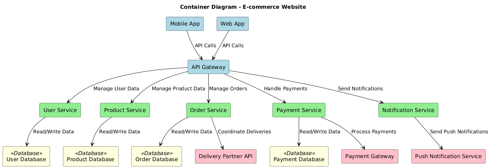
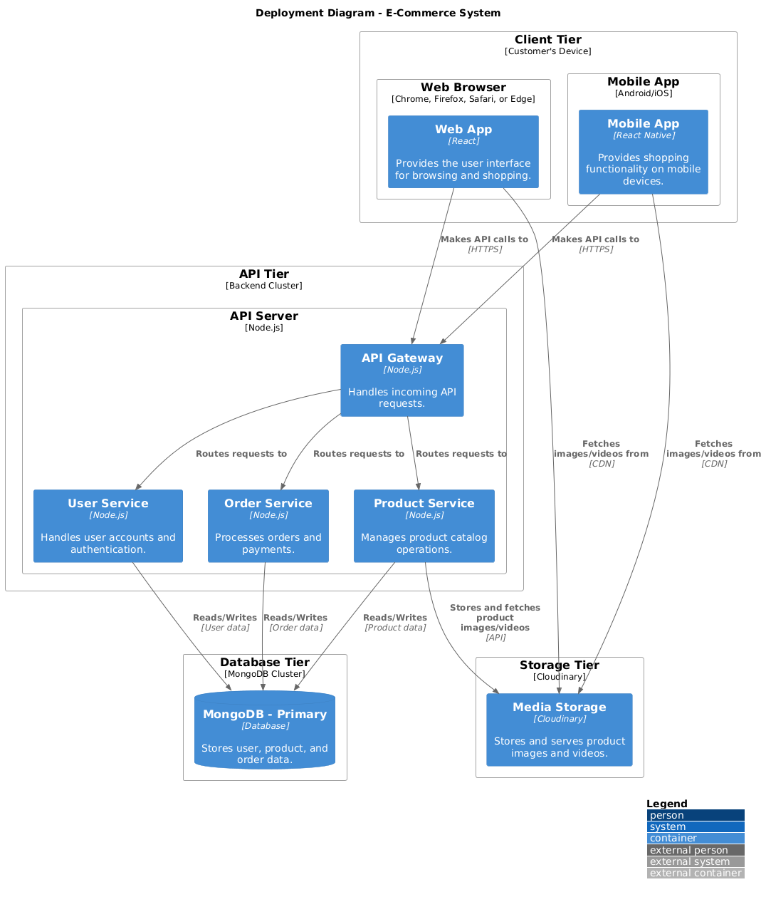
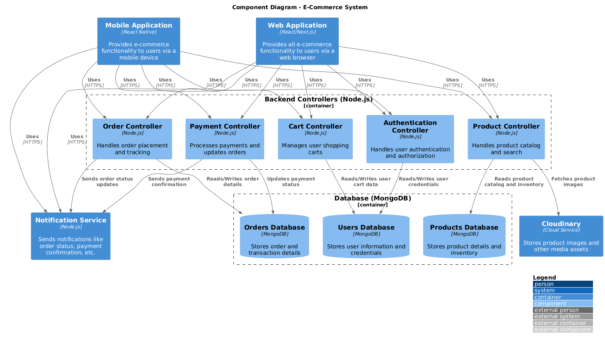

# Architecture Diagrams
## System Context Diagram


### Plant UML code
```
@startuml
!theme vibrant
' External Actors
actor "Buyer (User)" as Buyer
actor "Seller (User)" as Seller
actor "Employee" as Employee
actor "Shareholder" as Shareholder
actor "Delivery Partner" as DeliveryPartner
actor "Payment Partner" as PaymentPartner

' System Boundary: E-commerce Website
package "E-commerce Website" {

    ' Subsystems
    rectangle "User Registration \nand Authentication" as Registration
    rectangle "Product Search \nand Browsing" as SearchBrowsing
    rectangle "Product Listing \nand Management" as ProductManagement
    rectangle "Product Information" as ProductInfo
    rectangle "Shopping Cart \nand Checkout" as ShoppingCart
    rectangle "Payment Integration" as Payment
    rectangle "Order Tracking \nand Management" as OrderManagement
    rectangle "Sales Reporting \nand Analytics" as SalesAnalytics
    rectangle "Notifications" as Notifications
    rectangle "Customer Support" as Support
}

' Buyer interactions
Buyer --> Registration : Sign Up/Login
Buyer --> SearchBrowsing : Search & Filter Products
Buyer --> ProductInfo : View Product Details
Buyer --> ShoppingCart : Add to Cart
Buyer --> Payment : Make Payment
Buyer --> OrderManagement : Track Orders
Buyer --> Notifications : Get Updates
Buyer --> Support : Request Assistance

' Seller interactions
Seller --> Registration : Sign Up/Login
Seller --> ProductManagement : Add/Edit Products
Seller --> SalesAnalytics : Analyze Sales
Seller --> OrderManagement : Manage Orders
Seller --> Notifications : Order Alerts
Seller --> Support : Request Help

' Employee interactions
Employee --> SalesAnalytics : Analyze Performance
Employee --> OrderManagement : Oversee Deliveries
Employee --> Support : Assist Buyers/Sellers

' Shareholder interactions
Shareholder --> SalesAnalytics : View Financial Reports
Shareholder --> Notifications : Receive Updates

' Delivery Partner interactions
DeliveryPartner --> OrderManagement : Update Order Status
DeliveryPartner --> Notifications : Delivery Alerts

' Payment interactions
Payment --> PaymentPartner : Process Transactions
@enduml
```
## Container Diagram



### Plant UML code
```
@startuml
!define RECTANGLE rectangle
!define BOLD **<color:Black>**

title Container Diagram - E-commerce Website

' Add primary containers
' User section
RECTANGLE "Mobile App" as mobileApp #lightblue
RECTANGLE "Web App" as webApp #lightblue
RECTANGLE "API Gateway" as apiGateway #lightblue

' Backend services
RECTANGLE "User Service" as userService #lightgreen
RECTANGLE "Product Service" as productService #lightgreen
RECTANGLE "Order Service" as orderService #lightgreen
RECTANGLE "Payment Service" as paymentService #lightgreen
RECTANGLE "Notification Service" as notificationService #lightgreen

' Database containers
RECTANGLE "User Database" as userDB <<Database>> #lightyellow
RECTANGLE "Product Database" as productDB <<Database>> #lightyellow
RECTANGLE "Order Database" as orderDB <<Database>> #lightyellow
RECTANGLE "Payment Database" as paymentDB <<Database>> #lightyellow

' External systems
RECTANGLE "Payment Gateway" as paymentGateway #pink
RECTANGLE "Push Notification Service" as pushNotification #pink
RECTANGLE "Delivery Partner API" as deliveryAPI #pink

' Relationships between containers
mobileApp --> apiGateway : "API Calls"
webApp --> apiGateway : "API Calls"

apiGateway --> userService : "Manage User Data"
apiGateway --> productService : "Manage Product Data"
apiGateway --> orderService : "Manage Orders"
apiGateway --> paymentService : "Handle Payments"
apiGateway --> notificationService : "Send Notifications"

userService --> userDB : "Read/Write Data"
productService --> productDB : "Read/Write Data"
orderService --> orderDB : "Read/Write Data"
paymentService --> paymentDB : "Read/Write Data"

paymentService --> paymentGateway : "Process Payments"
notificationService --> pushNotification : "Send Push Notifications"
orderService --> deliveryAPI : "Coordinate Deliveries"
@enduml
```

## Deployment Diagram



### Plant UML code
```
@startuml
!include https://raw.githubusercontent.com/plantuml-stdlib/C4-PlantUML/master/C4_Deployment.puml

LAYOUT_WITH_LEGEND()
title Deployment Diagram - E-Commerce System

Deployment_Node(client, "Client Tier", "Customer's Device") {
    Deployment_Node(browser, "Web Browser", "Chrome, Firefox, Safari, or Edge") {
        Container(web_app, "Web App", "React", "Provides the user interface for browsing and shopping.")
    }
    Deployment_Node(mobile, "Mobile App", "Android/iOS") {
        Container(mobile_app, "Mobile App", "React Native", "Provides shopping functionality on mobile devices.")
    }
}

Deployment_Node(api, "API Tier", "Backend Cluster") {
    Deployment_Node(api_server, "API Server", "Node.js") {
        Container(api_gateway, "API Gateway", "Node.js", "Handles incoming API requests.")
        Container(product_service, "Product Service", "Node.js", "Manages product catalog operations.")
        Container(user_service, "User Service", "Node.js", "Handles user accounts and authentication.")
        Container(order_service, "Order Service", "Node.js", "Processes orders and payments.")
    }
}

Deployment_Node(storage, "Storage Tier", "Cloudinary") {
    Container(media_storage, "Media Storage", "Cloudinary", "Stores and serves product images and videos.")
}

Deployment_Node(data, "Database Tier", "MongoDB Cluster") {
    ContainerDb(mongo_primary, "MongoDB - Primary", "Database", "Stores user, product, and order data.")
    
}


' Relationships
Rel(web_app, api_gateway, "Makes API calls to", "HTTPS")
Rel(mobile_app, api_gateway, "Makes API calls to", "HTTPS")

Rel(api_gateway, product_service, "Routes requests to")
Rel(api_gateway, user_service, "Routes requests to")
Rel(api_gateway, order_service, "Routes requests to")

Rel(product_service, mongo_primary, "Reads/Writes", "Product data")
Rel(user_service, mongo_primary, "Reads/Writes", "User data")
Rel(order_service, mongo_primary, "Reads/Writes", "Order data")

Rel(product_service, media_storage, "Stores and fetches product images/videos", "API")
Rel(web_app, media_storage, "Fetches images/videos from", "CDN")
Rel(mobile_app, media_storage, "Fetches images/videos from", "CDN")
@enduml
```
## Component Diagram



### Plant UML code
```
@startuml
!include https://raw.githubusercontent.com/plantuml-stdlib/C4-PlantUML/master/C4_Component.puml

LAYOUT_WITH_LEGEND()
title Component Diagram - E-Commerce System

' Web Application
Container(web, "Web Application", "React/Next.js", "Provides all e-commerce functionality to users via a web browser")

' Mobile Application
Container(mobile, "Mobile Application", "React Native", "Provides e-commerce functionality to users via a mobile device")

' Backend Controllers
Container_Boundary(api, "Backend Controllers (Node.js)") {
    Component(auth, "Authentication Controller", "Node.js", "Handles user authentication and authorization")
    Component(cart, "Cart Controller", "Node.js", "Manages user shopping carts")
    Component(order, "Order Controller", "Node.js", "Handles order placement and tracking")
    Component(product, "Product Controller", "Node.js", "Handles product catalog and search")
    Component(payment, "Payment Controller", "Node.js", "Processes payments and updates orders")
}

' Notification Service
Container(notification, "Notification Service", "Node.js", "Sends notifications like order status, payment confirmation, etc.")

' Database
Container_Boundary(database, "Database (MongoDB)") {
    ComponentDb(users, "Users Database", "MongoDB", "Stores user information and credentials")
    ComponentDb(products, "Products Database", "MongoDB", "Stores product details and inventory")
    ComponentDb(orders, "Orders Database", "MongoDB", "Stores order and transaction details")
}

' Storage Service
Container(cloudinary, "Cloudinary", "Cloud Service", "Stores product images and other media assets")

' Relationships
Rel(web, auth, "Uses", "HTTPS")
Rel(web, cart, "Uses", "HTTPS")
Rel(web, order, "Uses", "HTTPS")
Rel(web, product, "Uses", "HTTPS")
Rel(web, payment, "Uses", "HTTPS")
Rel(web, notification, "Uses", "HTTPS")

Rel(mobile, auth, "Uses", "HTTPS")
Rel(mobile, cart, "Uses", "HTTPS")
Rel(mobile, order, "Uses", "HTTPS")
Rel(mobile, product, "Uses", "HTTPS")
Rel(mobile, payment, "Uses", "HTTPS")
Rel(mobile, notification, "Uses", "HTTPS")

Rel(auth, users, "Reads/Writes user credentials")
Rel(cart, users, "Reads/Writes user cart data")
Rel(order, orders, "Reads/Writes order details")
Rel(product, products, "Reads product catalog and inventory")
Rel(product, cloudinary, "Fetches product images")
Rel(payment, orders, "Updates payment status")
Rel(order, notification, "Sends order status updates")
Rel(payment, notification, "Sends payment confirmation")

@enduml
```